### HTML基础

##### 一、HTML基本格式

一个标准的html文档的基本格式如下：

```html
<!DOCTYPE html>
<html lang="en">
<head>
    <meta charset="UTF-8">
    <meta http-equiv="X-UA-Compatible" content="IE=edge">
    <meta name="viewport" content="width=device-width, initial-scale=1.0">
    <title>Document</title>
</head>
<body>

</body>
</html>
```

`<!DOCTYPE html>`：该标签功能：告诉浏览器后面内容是html5规范的语法。

`html标签`：包括了html的所有内容，被称为根元素。

`head标签`：所有头部元素的容器，描述了文档的各种属性和信息，如：文档的标题、文档引用的*样式表*和*JS脚本文件*等，绝大多数文档头部包含的数据都不会真正作为内容显示给用户。

`<meta charset="UTF-8">`：是用于设置字符集，讲文档应该使用的字符集设置为UTF-8，包括了书面语言的大多数字符，基本上可以处理放在页面上的任何文本内容。

`title标签`：设置了页面的标题，也就是出现浏览器标签中的内容，也被用来描述页面加入书签或收藏时的标题。

`body标签`：包含了页面展示的所有内容，如：文字、图片、视频、游戏、可播放的音乐等等。

##### 二、常用标签

###### 1.标题和段落标签

<mark>标题标签</mark>，只有h1 ~h6 这6个标题标签，字体大小依次减小。

```html
<h1>1级标题</h1>
<h2>2级标题</h2>
<h3>3级标题</h3>
<h4>4级标题</h4>
<h5>5级标题</h5>
<h6>6级标题</h6>
```

<mark>段落标签</mark>：`p标签`

```html
<p>
  段落内容
</p>
```

###### 2.图片标签

支持图片格式：gif、jpg、jpeg、png、bmp、webp。

```html

```

属性：

`src`：图片的资源地址，支持本地图片、网络图片；

`alt`：图片说明，当图片加载失败时会显示该内容

`title`：用于鼠标放到图片上时显示文字；

###### 3.超链接

<mark>页面跳转</mark>

标签：`<a>`

```html
<!-- 超链接 -->
<a href="http://www.baidu.com">百度</a>
<a href="http://www.baidu.com" target="_blank">新标签打开百度</a>
<a href="http://www.baidu.com" target="_parent">parent方式打开百度</a>
<a href="http://www.baidu.com" target="_top">top方式打开百度</a>
```

属性：

`href`：超链接跳转地址，可以是本地路径/相对路径、url地址，若是url地址时务必添加`http`或`https`，否则无法正常跳转页面；

`target`：定义超链接页面的打开方式，有以下几个值：

- _self：内容在<mark>当前页面</mark>显示

- _blank：内容在<mark>新的页面</mark>显示；

- _parent：在父窗体中打开链接，在窗口与顶级框架中，等同于_self

- _top：在当前窗体打开链接，并替换当前的整个窗体(框架页)，清除所有包含的框架

<mark>锚点跳转</mark>

即页面内部位置跳转，通过给超链接的`href`属性设置以`#{id值}`的方式实现页面内部锚点跳转。

示例如下：

```html
<p id="p0">
   <a href="#p1">锚点跳转1</a>
   <a href="#p2">锚点跳转2</a>
</p>
<p>
    ...
    <p id="p1">
        ...
    </p>
    <p id="p2">
        ...
    </p>
</p>
<p>
    <a href="#p0">回到顶部</a>
</p>
```

上述代码定义了几个p标签，给其设置了id值，然后给超链接a标签的属性href设置跳转锚点。

###### 4.文本修饰标签

| 标签          | 标签功能说明                |
| ----------- | --------------------- |
| `<b >`      | bold的缩写，文字加粗          |
| `<strong >` | 文字加粗，阅读时会被加重读音，推荐使用   |
| `<i >`      | italic的缩写，字体倾斜        |
| `<em >`     | 字体倾斜，有加强语气            |
| `<u >`      | underline的缩写，文字下划线    |
| `<s >`      | strike的缩写，文字带删除线      |
| `<del >`    | delete的缩写，文字带删除线      |
| `<sup >`    | 文字上标签，如：2<sup>2</sup> |
| `<sub >`    | 文字下标签，如：O<sub>2</sub> |

示例如下：

```html
<p><b>b标签 文字加粗</b></p>
<p><strong>strong标签 文字加粗，阅读时会被加重读音</strong></p>
<p><i>我会倾斜</i></p>
<p><em>我会倾斜，有强调作用</em></p>
<p><u>我是下划线标签</u></p>
<p><s>删除线标签</s></p>
<p><del>del删除线标签</del></p>
<p>π * 3<sup>2</sup></p>
<p>CO<sub>2</sub></p>
```

###### 5.列表标签

HTML中列表分为：有序列表、无序列表、自定义列表。

| 类型    | 标签                  | 说明  |
| ----- | ------------------- | --- |
| 有序列表  | `<ol >、<li >`       | 有顺序 |
| 无序列表  | `<ul >、<li >`       | 无序  |
| 自定义列表 | `<dl >、<dt >、<dd >` | -   |

<mark>有序列表</mark>：

语法：`<ol><li></li></ol>`，

规定ol标签中不能有其它内容，若想添加其它内容，必须放在li标签中。

列表的序号默认为阿拉伯数字，从1开始。

可以通过ol标签的`type属性`进行设置序号的类型。

- 1，阿拉伯数字顺序

- A，大写字母顺序

- a，小写字母顺序

- I，大写罗马数字顺序，I、II、III、IV、V、VI、VII、VIII、IX、X ······

- i，小写罗马数字顺序，i ii iii iv v vi vii viii ······

可以通过ol标签的`start属性`进行设置列表的起始序号，数值形式。

如下示例：

```html
<ol type="i" start="2">
    <li>小米</li>
    <li>华为</li>
    <li>OPPO</li>
</ol>
```

<mark>无序列表</mark>：<ul>

```html
<p>无序列表</p>
<ul type="disc">
    <li>小米</li>
    <li>华为</li>
    <li>OPPO</li>
</ul>
```

type属性有以下几个值：

- disc：实心圆

- circle：空心圆

- none：无样式

- square：方块

<mark>自定义列表</mark>：`<dl>`、`<dt>`、`<dd>`

dl：definition list的缩写，定义列表；

dt：definition term的缩写，可以理解为标题，定义术语；

dd：definition description的缩写，定义描述

如下示例：

```html
<p>自定义列表</p>
<dl>
    <dt>自定义列表的标题</dt>
    <dd>小米</dd>
    <dd>华为</dd>
    <dd>OPPO</dd>
</dl>
```

###### 6.table标签

涉及标签

| 标签            | 描述             |
| ------------- | -------------- |
| `<table >`    | 表格             |
| `<caption >`  | 表格头部，标题        |
| `<tr >`       | 行              |
| `<td >`       | 单元格            |
| `<th >`       | 单元格，文字加粗       |
| `<thead >`    | 表格头，内包含<tr>    |
| `<tbody >`    | 表格正文内容，内包含<tr> |
| `<tfoot >`    | 表格尾，内包含<tr>    |
| `<colgroup >` | 列分组            |

`table`属性

- border：表格边框粗细；

- cellspacing：单元格的间距；

- cellpadding：单元格的内边距；

- width：表格宽度

- height：表格高度

- align：表格在父布局中居中

- bgcolor：表格背景色

- bordercolor:表格边框颜色

`td`属性

- rowspan：单元格跨行的数量

- colspan：单元格跨列的数量

- bgcolor：单元格背景色

- align：单元格文字居中

示例：

```html
<table border="1" align="center" width="600" cellspacing="0" cellpadding="0" bordercolor="#fff" bgcolor="#d8eaef" >
        <caption>阿里职级与薪资</caption>
        <colgroup span="1" bgcolor="#92c5d5"></colgroup>
        <thead bgcolor="#66a9be">
            <tr >
                <th rowspan="2">序号</th>
                <th colspan="6">技术岗与管理岗的职级薪资</th>
            </tr>
            <tr>
                <th>P序列</th>
                <th>P级名称</th>
                <th>M序列</th>
                <th>M级名称</th>
                <th>薪资</th>
                <th>股票</th>
            </tr>
        </thead>
        <tbody align="center">
            <tr>
                <th>1</th>
                <td>P6</td>
                <td>资深工程师</td>
                <td>M1</td>
                <td>主管</td>
                <td>20W-35W</td>
                <td>几乎不授予</td>
            </tr>
            <tr>
                <th>2</th>
                <td>P7</td>
                <td>技术专家</td>
                <td>M2</td>
                <td>经理</td>
                <td>30W-50W</td>
                <td>2400股</td>
            </tr>
            <tr>
                <th>3</th>
                <td>P8</td>
                <td>高级专家</td>
                <td>M3</td>
                <td>高级经理</td>
                <td>45W-80W</td>
                <td>6400股</td>
            </tr>
            <tr>
                <th>4</th>
                <td>P9</td>
                <td>资深专家</td>
                <td>M4</td>
                <td>总监</td>
                <td>80W-100W</td>
                <td>16000股</td>
            </tr>
            <tr>
                <th bgcolor="#92c5d5">5</th>
                <td>P10</td>
                <td>研究员</td>
                <td>M5</td>
                <td>高级总监</td>
                <td>150W+</td>
                <td>20000股</td>
            </tr>
        </tbody>
        <tfoot>
            <tr>
                <th bgcolor="#acc47a">说明</th>
                <td colspan="6" bgcolor="#d8e1c6">P-Profession M-Manager,马云在阿里的级别是M10</td>
            </tr>
        </tfoot>
    </table>
```

###### 7.块级元素和内联元素

<mark>块级元素</mark>：独占一行，block块元素

常见块级元素：

- 标题元素：`h1`  ~ `h6`

- 段落元素：`p`

- 列表元素：`ol`、`ul`、`li`、`dl`、`dt`、`dd`

- 表格元素：`table`、`tr`、`td`、`th`、`thead`、`tbody`、`tfoot`、`caption`

- 分块元素：`div`

inline内联元素：不会独占一行，只占用必要的宽度。

常见内联元素：

- 文本修饰元素：`b`、`strong`、`i`、`em`、`sub`、`sup`、`u`、`del`、`s`

- 链接元素：`a`

- 换行元素：`br`

- 图片元素：`img`

- 范围元素：`span`

**注意：内联元素不能嵌套块级元素**

###### 8.表单

标签：`<form>`

form属性

- action，用来指定处理提交表单格式，通常是一个url地址或一个电子邮件地址

- method，默认为get，值为post/get，数据提交方式

- name，对表单进行标记

- enctype，数据提交给服务器时的形式，默认：application/x-www-form-  
  urlencoded

- target，指定提交后文档显示位置，值：`_blank`、`_self`、`_parent`、`_top`

- accept-charset="gbk"，设置编码格式，针对非IE浏览器

- _charset="gbk"，设置编码格式，针对IE浏览器

表单标签需要放在`<form>`标签内使用，常用标签如下

| 标签                         | 描述      | 属性                                             |
| -------------------------- | ------- | ---------------------------------------------- |
| `<input >`                 | 单行文本框   | type(值参考后内容)、name、id、readonly(只读)、disable禁用    |
| `<textarea >`              | 多行文本输入框 | name、id、cols(列数)、rows(行数)                      |
| `<input type="radio" >`    | 单选框     | name(控制分组)、id、checked(选中)                      |
| `<input type="checkbox" >` | 复选框     |                                                |
| `<input type="file" >`     | 文件选择控件  |                                                |
| `<select >`                | 下拉菜单    | 包裹<option>标签实现、<br/>multiple(选择多行)、size(展示的行数) |
| `<label >`                 | 标签      | for                                            |
| `<fieldset >`              | 表单控件分组  | <fieldset><legend>标题</legend><fieldset>        |
| `<button >`                | 双标签按钮   |                                                |

`type属性`，可以分为文本输入框、密码输入框、按钮、单选框、复选框等，其值如下：

- text，普通文本输入框，默认值

- password，密码输入框，以`·`替代实际输入值

- email，邮件地址文本输入框

- tel，用于提供输入电话号码的文本框，tel类型通常会和 pattern属性配合使用

- url，用于输入URL地址的文本框

- number：数字输入框，`value`初始值，`max`最大值,`min`最小值，`sep`数字间隔

- button，普通按钮

- submit，提交按钮，`value`属性改变按钮的文本

- reset，重置按钮，`value`属性改变按钮的文本

- radio：单选框，通过`name`属性值控是否同组，`checked`设置选中

- checkbox，复选框，通过`checked`属性指定默认选中项

- image，图像形式的提交按钮，同button，通过`src`属性指定图像

- hidden，隐藏域对于用户是不可见的，通常用于后台的程序

- file，文件选择器

- search，用于输入搜索关键词的文本框

- color，颜色设置框，选择颜色值

- range，提供一定范围内数值的输入范围，在网页中显示为`滑动条`，属性类似number

- datetime，以下几个属性是日期、时间相关选择器

- datetime-local

- date

- month

- week

- time

示例：

```html
<form action="">
        <!-- 输入框 -->
        输入文字：<input type="text">
        <br>
        敏感信息：<input type="password">

        <br>
        <!-- 多行文本框 -->
        多行文本框：<textarea name="" id="" cols="30" rows="3"></textarea>
        <br>
        <!-- 单选 -->
        选择性别：<input type="radio" name="sex" checked>男
        <input type="radio" name="sex">女

        <br>
        <!-- 多选框 -->
        选择科目：<input type="checkbox" name="subjects" id="1" checked>语文
        <input type="checkbox" name="subjects" id="2">数学
        <br>
        <!-- 下拉单选择框 -->
        下拉单选择框：
        <select name="" id="">
            <option value="1">语文</option>
            <option value="2" selected>数学</option>
        </select>
        <br>
        <!-- 下拉多选选择框 -->
        下拉多选选择框：
        <select name="" id="" multiple>
            <option value="1">语文</option>
            <option value="2" selected>数学</option>
        </select>
        <br>
        <!-- 表单分组 -->
        <fieldset>
            <legend>表单分组</legend>
            用户名：<input type="text">
            <br>
            密 码：<input type="password" name="" id="">
        </fieldset>
    </form>
```

###### 9.其它标签

- 分割线：`<hr>`
  
  - width/size：分别控制水平线的宽度和高度
  
  - noshade：用来去掉水平线阴影
  
  - color：用于定义水平线颜色
  
  - align：用来调整水平线水平对齐方式，默认水平居中

- 预格式化的文本：`<pre>`，将完全安装HTML源代码的内容显示。

- `<map>`，定义一个图像的映射，在不同区域实现点击不同位置的跳转
  
  - name，与img标签的属性`usemap`相关联，在图像和地图间创建关系。
  
  - <area>子标签，单标签，定义图片上的热点区域，实现热点区域的位置、大小及形状
    
    - herf：用来定义热点区域链接的目标地址
    
    - shape：用来定义区域的形状，取值：default(所有区域)、rect、circle、poly(多边形)
    
    - coords：用来定义可点击区域的坐标。与shape属性搭配使用

###### 10.iframe

碎片化处理的，类似Android的fragment。

语法：`<iframe ></iframe>`

属性有：

- src：定义页面路径

- width：定义宽度

- height：定义高度

- frameborder：定义边框，默认有边框，通过设置0取消边框

- scrolling：控制是否显示框架的滚动条，值有：
  
  - yes，始终显示滚动条
  
  - auto，在需要的情况下显示滚动条
  
  - no，从不显示滚动条

- name：通常与`<a>`的target属性关联

##### 三、SVG标签

svg是基于XML语法的图像格式，全称：Scalable Vector Graphics，即可缩放矢量图。

svg图片可以``加载。

svg可以绘制基本图形，如：直线、圆形、矩形、多边形、路径等，下面就详细介绍下。

###### 1.绘制线条

语法：`<line/>`，单标签

基本属性：

- x1，起始点x坐标

- y1，起始点y坐标

- x2，结束点x坐标

- y2，结束点y坐标

- stroke-width：定义矩形的边框宽度

- stroke：定义矩形边框的颜色

示例：

```html
<!-- 绘制直线 -->
<svg width="300" height="30">

    <line x1="20" y1="10" x2="180" y2="20" stroke-width="3" stroke="red"/>
</svg>
```


###### 2.绘制矩形

语法：`<rect/>`，单标签

属性：

- width：定义矩形宽度

- height：定义矩形高度

- fill：定义矩形的填充颜色

- fill-opacity：定义填充颜色的不透明度，值：0 ~ 1

- stroke-width：定义矩形的边框宽度或轮廓厚度

- stroke：定义矩形边框的颜色

- stroke-opacity：定义描边颜色的不透明度，值：0 ~ 1

- stroke-linecap：笔画笔帽属性，即线条末尾样式，有：`butt`：没线帽，`round`：圆形，`square`：方形

- stroke-dasharray：虚线笔画属性，数字序列如：20，10，
  
  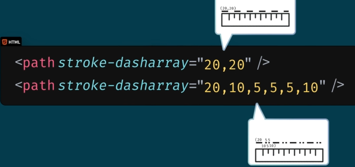

- x：起始点x坐标

- y：起始点y坐标

- rx：定义x轴方向的圆角长度

- ry：定义y轴方向的圆角长度

示例：

```html
<svg>
   <rect width="200" height="50" fill="yellow" 
    stroke-width="1" stroke="red"/>
</svg>
```


###### 3.绘制圆形

语法：`<circle/>`，单标签

属性：

- cx：定义圆形中心的x坐标，默认为坐标原点0

- cy：定义圆形中心的y坐标，默认为坐标原点0

- r：定义圆形的半径

- fill：定义矩形的填充颜色

- fill-opacity：定义填充颜色的不透明度，值：0 ~ 1

- stroke-width：定义矩形的边框宽度

- stroke：定义矩形边框的颜色

- stroke-opacity：定义描边颜色的不透明度，值：0 ~ 1

示例：

```html
<svg width="300" height="80">
    <circle cx="40" cy="40" r="30" />
    <circle cx="100" cy="40" r="30" fill="transparent" 
        stroke-width="5" stroke="blue"/>
</svg>
```


###### 4.绘制椭圆形

语法：`<ellipse/>`，单标签

除了有：fill、stroke、fill-opacity、stroke-width、stroke-opacity属性外，还有属性：

- cx：椭圆中心的x坐标

- cy：椭圆中心的y坐标

- rx：定义椭圆水平半径

- ry：定义椭圆垂直半径

示例：

```html
<!-- 绘制椭圆 -->
<svg width="300" height="100">
    <ellipse cx="50" cy="40" rx="40" ry="20" />
    <ellipse cx="150" cy="40" rx="40" ry="20" fill="transparent" 
        stroke-width="5" stroke="blue"/>
</svg>
```


###### 5.绘制多边形

语法：`<polygon/>`，单标签

同样有`fill`、`stroke`、`fill-opacity`、`stroke-width`、`stroke-opacity`属性外，还有属性：

- points，多边形每个顶点的x,y坐标，形式为：`100,20 150,35 160,70`

```html
<!-- 绘制多边形 -->
<svg width="500" height="200">

    <!-- 三角形 -->
    <polygon points="10,10 100,45 60,60" fill="lime" stroke-width="1" stroke="red"/>
    <!-- 长方形 -->
    <polygon points="120,10 190,10 190,60 120,60" fill="lime" stroke-width="1" stroke="red"/>
    <!-- 五角星 -->
    <polygon points="300,10 240,198 398,78 210,78 360,198" fill="grey" stroke-width="1" stroke="blue"/>
</svg>
```

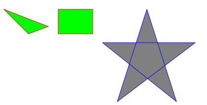

###### 6.绘制多线条(折线)

语法：`<polyline/>`，单标签

属性同`<polygon/>`，参加上述。

绘制的区域不会进行封闭。

示例：

```html
<!-- 绘制多边形 -->
<svg width="500" height="200">    
    <!-- 折线 -->
    <polyline points="10,10 100,45 150,20 180,60 210,10" 
        fill="none" stroke-width="1" stroke="red"/>
</svg>
```


<mark>值得注意</mark>：绘制折线默认会有填充色，可通过设置`fill`属性为`none`值去掉填充色。

###### 7.绘制文本

基本语法：`<text></text>` ，双标签.

属性：

- x，文字起始点左下角x坐标

- y，文字起始点左下角y坐标

- fill，文字颜色

- transform，文字变换，如：rotate、scale

- font-size，文字大小

- text-anchor，对齐方式，可选值有：`start`、`center`、`end`
  
  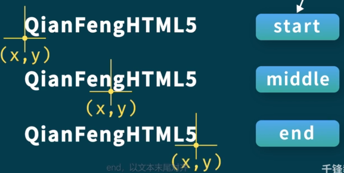

示例：

```html
<!-- 绘制文本 -->
<svg width="500" height="110">
    <text x="20" y="35" fill="red" >0基础学习HTML</text>
    <!-- 旋转文字 -->
    <!-- rotate(20 200,20) 第一个为角度，后面为旋转中心点坐标 缺省时为坐标原点0,0-->
    <text x="180" y="35" fill="blue" transform="rotate(20 200,20)">0基础学习HTML</text>
    <!-- 多行文本 -->
    <text x="20" y="60">
        多行文本
        <tspan x="20" y="80">第一行文本</tspan>
        <tspan x="20" y="100">第二行文本</tspan>
    </text>
</svg>
<br>
<!-- 给文本添加超链接 -->
<svg width="500" height="50" xmlns:xlink="http://www.w3.org/1999/xlink">
    <a xlink:href="https:www.baidu.com" target="_blank">
        <text x="20" y="20" fill="blue">我时一个超链接文本</text>
    </a>
</svg>
```

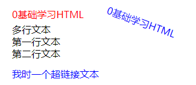

###### 8.绘制路径

基本语法：`<path/>` 单标签

重要属性：

- d，绘制属性（draw的缩写），常用的绘制命令有：
  
  - M命令，moveto缩写，表示绘制的起点坐标，如：M20 10或M 20 10或M20,10或M 20,10；
  
  - L命令，lineto的缩写，表示绘制一条直线，如：l50 10或者l 50 10，表示从上一个结束点到(50,10)绘制一条直线；
  
  - H命令，水平线到
  
  - V命令，垂直线到
  
  - C命令，curveto，三次贝塞尔曲线，如：C 150，-300 300,0 50,150 100,200
  
  - S命令，平滑曲线
  
  - Q命令，绘制二次贝塞尔曲线，要定义控制点和终点坐标，如：q 150 -300 300 0，表示控制点是(150,-300),终点坐标(300,0)，如图示：
    
    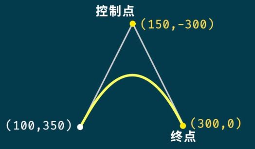
  
  - T命令，光滑二次贝塞尔曲线to
  
  - A命令，椭圆弧
  
  - Z命令，closepath闭合路径
  
  <mark>命令区分大小写，大写表示绝对定位，小写表示相对定位</mark>，如图示：
  
  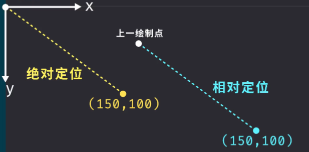

代码示例：

```html
<!-- 绘制path -->
<svg width="500" height="160">
    <!-- 通过path绘制一个三角形 -->
    <path d="M20 10 L60 36 L10 50" fill="blue"/>
    <!-- 绘制一条二次贝塞尔曲线 -->
    <path d="M120 40 Q175 -20 230 40" fill="none" stroke="red"/>
    <!-- 绘制一条三次贝塞尔曲线 -->
    <path d="M300 40 C300,0 350,0 320,80 430,160" fill="none" stroke="red"/>
    <!-- 绘制一条平滑曲线 -->
    <path d="M20 130 S100,20 150,110 200,40 300,140" fill="none" stroke="red"/>
</svg>
```

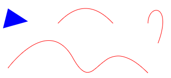

###### 9.<g>标签分组

语法：`<g></g>`双标签

含义：使用该标签对绘图元素进行分组，可以在`g标签`上添加公共属性，如:fill

```html
<!-- 通过g标签对相同属性的标签进行分组 -->
<svg width="500" height="100">
    <g font-size="20" fill="blue" text-anchor="middle">
        <text x="20" y="20">一组</text>
        <text x="20" y="45">二组</text>
        <text x="20" y="70">三组</text>
    </g>
</svg>
```


###### 10.模糊和阴影效果

<mark>模糊</mark>

语法：`<filter id></filter>`,经常定义在标签`defs`下

模糊效果：`<feGaussianBlur>`，设置其属性`stdDeviation`为一个值来实现，值越大越模糊，需要定义在`filter`标签内部。

```html
<!-- 模糊和阴影 -->
<svg width="500" height="120">
    <defs>
        <filter x="0" y="0" id="f1">
            <feGaussianBlur stdDeviation="3"/>
        </filter>
    </defs>
    <!-- 未模糊效果 -->
    <rect width="120" height="60" fill="yellow" stroke="blue" stroke-width="2"/>
    <!-- 通过filter属性实现模糊 -->
    <rect x="140" width="120" height="60" fill="yellow" stroke="blue" stroke-width="2" filter="url(#f1)"/>
</svg>
```

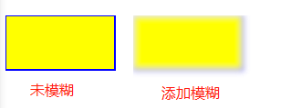

<mark>阴影</mark>

实现：`feOffset`和`feBlend`两个滤镜实现。两个均为单标签。

示例：

```html
<!-- 阴影 -->
<defs>
    <filter x="0" y="0" width="200" height="200" id="f2">
    <!-- SourceAlpha给图形制作一个黑色阴影-->
         <feOffset dx="20" dy="20" in="SourceAlpha"/>
         <!-- 给阴影添加一个模糊 -->
         <feGaussianBlur stdDeviation="10"/>
         <!-- SourceGraphic表示在偏移的图像上混合原始图像 -->
         <feBlend in="SourceGraphic"/>
    </filter>
</defs>
<rect y= "80" width="120" height="60" fill="yellow" stroke="blue" stroke-width="2" filter="url(#f2)"/>
```


###### 11.线性渐变和径向渐变

<mark>线性渐变</mark>

语法：`<linearGradient></linearGradient>`

属性：

- id，定义了渐变的唯一名称

- x1，渐变的起始x位置,百分比

- y1，渐变的起始y位置,百分比

- x2，渐变的结束x位置,百分比

- y2，渐变的结束y位置,百分比

颜色用单标签`stop`设置，如：<stop offset="10%" stop-color="yellow"/>

- offset：定义渐变颜色的开始和结束位置，其值是相对位置的百分比
  
  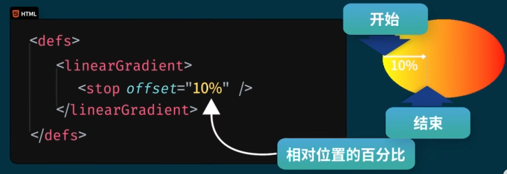

- stop-color：用于定义渐变的颜色

```html
<!-- 线性渐变和径向渐变 -->
<svg width="500" height="200">
    <defs>
        <linearGradient x1="0%" y1="0%" x2="100%" y2="100%" id="l1">
            <stop offset="20%" stop-color="rgb(255,255,0)"/>
            <stop offset="100%" stop-color="rgb(255,0,0)"/>
        </linearGradient>
    </defs>
    <!-- 线性渐变 -->
    <rect width="120" height="60" fill="url(#l1)"/>
</svg>
```


<mark>径向渐变</mark>

语法：`<radialGradient></radialGradient>`双标签

属性有：

- id，定义了渐变的唯一名称

- cx，定义最外面圆x

- cy，定义最外面圆x

- r，定义最外面圆半径

- fx，定义了最里面的圆

- fy，定义了最里面的圆


颜色也是使用`stop`实现

```html
<!-- 径向渐变 -->
<defs>
    <radialGradient id="r1" cx="50%" cy="50%" r="50%" fx="50%" fy="50%">
        <stop offset="0%" stop-color="rgb(255,255,255)"/>
        <stop offset="100%" stop-color="rgb(0,0,255)"/>
    </radialGradient>
</defs>
<rect x="200" width="120" height="60" fill="url(#r1)"/>
```


##### 四、CSS样式

###### 1.css样式分类

- 内联样式，又叫行内样式

- 内部样式，定义在style内部

- 外部样式，定义在外部css文件中，通过link方式引入

- 浏览器默认样式

2.样式优先级

- 内联样式 > 内部样式 、 外部样式 、 浏览器默认样式；

- 在head里添加的内部样式和引入的外部样式，后添加或引入的 优先级高；

- 浏览器默认的样式优先级最低

###### 2.CCS选择器

选择器类别：

- 简单选择器：根据名称、ID、类别来选择元素

- 组合选择器：根据元素之间的特定关系来选择元素；

- 伪类选择器：根据某种状态来选择元素；

- 伪元素选择器：为一个元素的指定部分设置样式；

- 属性选择器：根据一个属性或属性值来选择元素；

**简单选择器**

| 选择器分类     | 选择器定义语法         | 例子         | 例子说明                    |
| --------- | --------------- | ---------- | ----------------------- |
| ID选择器     | #id             | #firstname | 选择id="firstname"的元素     |
| 类选择器      | .class          | .intro     | 选择所有带有class="intro"的元素  |
| 类选择器(带元素) | element.class   | p.info     | 只选择带有class="info"的<p>元素 |
| 通用选择器     | *               | *          | 选择所有元素                  |
| 元素选择器     | element         | p          | 选择所有<p>元素               |
| 分组选择器     | element,element | div,p      | 选择所有<div>元素和所有<p>元素     |

**组合选择器**

| 选择器分类    | 选择器定义语法         | 例子    | 例子说明                  |
| -------- | --------------- | ----- | --------------------- |
| 后代选择器    | 父元素 子元素         | div p | 选择<div>元素内的所有<p>元素    |
| 子选择器     | 父元素>子元素         | div>p | 选择所有父元素是<div>元素的<p>元素 |
| 相邻的兄弟选择器 | element+element | div+p |                       |
| 一般兄弟选择器  | element~element | div~p |                       |

**伪类选择器**

属于类选择器的一种，根据特定状态选取元素。

语法：`:鼠标行为`

常用的有四种：

- `:link`，鼠标点击前样式

- `:visited`，鼠标点击后样式

- `:hover`，鼠标悬停时的样式

- `:active`，鼠标点击时的样式

注意事项：

1.冒号和后面的鼠标行为，没有任何空格，必须连接在一起；

2.四个伪类选择器必须按照以上介绍的顺序书写（:link,:visited,:hover,:active),否则在浏览器中部分样式不能实现；

3.伪类选择器全部一起使用的情况，主要应用在超链接上，偶尔也会独立使用在其它标签上面，但仅能实现（:hover，:active）效果。

**伪元素选择器**

通过伪元素选择器，可以设置元素指定部分的样式，主要用来设置元素内文本的首字母，首行的样式或是在元素内容之前或之后插入其它内容。

语法：`::pseudo-element`

常用五种选择器：

- `::first-letter`，实现文本首字母样式

- `::first-line`，用来实现向文本的首行添加特殊样式

- `::before`，用来实现在元素内容之前插入内容

- `::after`，用来实现在元素内容之后插入内容

- `::selection`，用来更改选中文本的样式，仅支持声明样式：color,background,cursor,outline

**属性选择器**

根据属性或属性值来查找元素

语法：

`Element[attribute]`

`Element[attribute="value"]`

其中：Element代表元素，atrribute代表属性

四种选择器：

- `[attribute]`:来查找HTML结构中，带有attribute属性的所有元素；

- `[attribute="value"]`：查找HTML结构中，带有attribute属性，并且属性值为value的元素；

- `[attribute~="value"]`：查找HTML结构中，带有attribute属性，并且在多个属性值中包含value的元素；

- `[attribute|="value"]`：查找HTML结构中，带有attribute属性，并且属性值以value或者是value-开头的元素。


###### 3.CSS文本

| 属性                                            | 功能                      | 值                                                                                              |
| --------------------------------------------- | ----------------------- | ---------------------------------------------------------------------------------------------- |
| color                                         | 文本颜色                    | rgb、名称、十六进制                                                                                    |
| font-size                                     | 字号，文字大小                 | 绝对大小：px<br/>相对大小：em<br/>百分比：%                                                                  |
| font-family                                   | 文字字体                    |                                                                                                |
| font-style                                    | 指定斜体文本                  | normal:正常显示<br/>italic:文本斜体显示<br/>oblique:斜体，支持度低                                              |
| font-weight                                   | 字体粗细                    | 名称：<br/>lighter：细体<br/>normal：正常字体<br/>bold:加粗字体<br/>bolder:更粗字体<br/>数值：100、200...900          |
| <a href="#fontvariant">font-variant</a>       | 小型大写字符显示(英文)，           | normal:正常显示<br/>smal-caps:设置为小型大写字符                                                            |
| <a href="#fontid">font</a>                    | 字体样式简写                  |                                                                                                |
| text-transform                                | 文本大小写转换(`仅英文`)          | uppercase：大写<br/>lower：小写<br/>capitalize：单词首字母大写                                               |
| text-align                                    | 文本水平对齐方式                | `left`：左对齐；<br/>`right`：右对齐;<br/>`center`：居中；<br/>`justify`：两端对齐                               |
| vertical-align                                | 文本垂直对齐                  | `baseline`:基线对齐;<br/>`text-top`:顶部对齐;  <br/> `text-bottom`:底部对齐;<br/>`sub`:下角标对齐;`super`:上角标对齐 |
| text-indent                                   | 文本缩进                    | 绝对值：px,如：50px; <br/>相对值：em,如：2em;                                                              |
| letter-spacing                                | 字符间隙                    |                                                                                                |
| line-height                                   | 行高(实际是两行基线间距)           | normal(默认值);<br/>数字(如:1.5)；<br/>绝对值(如:20px)                                                    |
| word-spaceing                                 | 英文单词间距                  |                                                                                                |
| white-space                                   | 处理元素内部空白                | nowrap:不换行；                                                                                    |
| text-decoration-line                          | 给文本添加线条修饰，可同时设置多个，用空格分隔 | overline:在文本上方添加<br/>line-through:在文本中间添加<br/>underline:在文本下方添加                                |
| text-decoration-color                         | 设置装饰线颜色                 |                                                                                                |
| text-decoration-style                         | 设置文本装饰线样式               | solid:实线<br/>double:双实线<br/>dotted:圆点线<br/>dashed:虚线<br/>wavy:波浪线                              |
| text-decoration-thickness                     | 设置装饰线的厚度，即粗细            | auto:默认值<br/>px:像素大小<br/>%:百分比,依据修饰文字高度计算                                                      |
| <a href="#textdecoration">text-decoration</a> | 文本线条修饰样式简写              |                                                                                                |

<span id="fontvariant">**font-variant**</span>

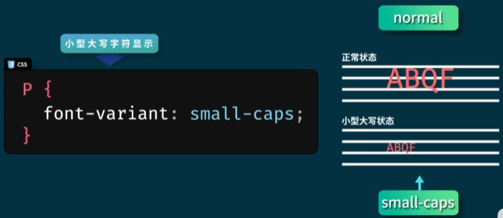

<span id="fontid">**font**</span>

字体样式的简写形式，可以把`font-style`、`font-variant`、`font-weight`、`font-size`、`line-height`、`font-family`组合在一起,

其中`font-size`和`font-family`为必须设置。

示例：

```css
font:italic 100 small-caps 30px/30px 华文仿宋
```


<span id="textdecoration">**text-decoration**</span>

语法：text-decoration:线条 线条颜色 线条样式 线条粗细

示例：text-decoration:underline red solid auto

说明：四个属性值中无先后顺序，但是必须设置`线条属性`，其它三个可缺省

无需下划线状态时可设置为`none`,如下：

```css
text-decoration:none
```

**谷歌字体**

在html的head中引入样式

```
<link rel="stylesheet" href="https://fonts.googleapis/css?family=Sofia&effect=fire">
```

解释:

family：为引入的字体，支持同时引入多个用`|`分隔，如：family=Sofia|Trirong

effect：字体效果，支持同时引入多个用`|`分隔，如：effect=fire|outline

**Icon图标**

图标库网站：[Font Awesome图标库](https://fontawesome.com)

###### 4.CSS选择器的权重

样式优先级：

> 行内样式 > ID选择器 > 类选择器 > 元素选择器 > 通用选择器

样式发生冲突时，谁的权重值高谁的优先级就高。


###### 5.CSS边框

| 属性                                      | 功能                                              |
| --------------------------------------- | ----------------------------------------------- |
| <a href="#borderstyle">border-style</a> | 边框样式                                            |
| border-left-style                       | 左边框样式                                           |
| border-top-style                        | 上边框样式                                           |
| border-right-style                      | 右边框样式                                           |
| border-bottom-style                     | 下边框样式                                           |
| <a href="#borderwidth">border-width</a> | 边框宽度                                            |
| <a href="#bordercolor">border-color</a> | 边框颜色                                            |
| <a href="#border">border</a>            | 速记属性，同时设置border-style、border-width、border-color |
| border-top                              | 上边                                              |
| border-right                            | 右边                                              |
| border-bottom                           | 下边                                              |
| border-left                             | 左边                                              |

<span id="borderstyle">**border-style**</span>

含义：边框样式，如：border-style:hidden;

- dotted：定义一个点状的边框；

- dashed：定义一个虚线边框；

- solid：定义一个实线边框；

- double：定义一个双倍的边框；

- none：定义无边框；

- hidden：定义一个隐藏的边框

主要边框属性冲突时：

> border-style:hidden > border-style:solid > border-style:none

可以对单个边框进行设置分别如下：

`border-left-style`：左边框

`border-right-style`：右边框

`border-top-style`：上边框

`border-bottom-style`：下边框

支持混合简写，设置多个值时，分别代表含义下：

```css
//           上边    右边   下边    左边    
border-style:dotted solid double dashed
//           上边    左右边  下边    
border-style:dotted solid double
//           上下边   左右边
border-style:dotted solid
//           四个边
border-style:dotted
```

<span id="borderwidth">**border-width**</span>

含义：边框宽度

单位：px、em

预定义值有：

- thin：薄

- medium：中

- thick：厚

```css
border-width:5px
border-width:0.5em
border-width:thin
```

同样支持混合简写，即单独对单边设置，代表含义同`border-style`。

<span id="bordercolor">**border-color**</span>

含义：边框颜色

值：颜色名称、十六进制颜色值、RGB颜色值

```css
border-color:red
border-color:#ffffff
border-color:rgb(255,0,0)
border-color:red blue green yellow
```

支持混合简写，多单个边设置颜色，含义同`border-style`

<span id="border">**border**</span>

含义：速记属性，同时设置border-style、border-width、border-color

```css
//    粗细   样式  颜色
border:1px  solid red
```

其中，边框样式必须写，其它两个可省略，若省略则使用默认的粗细：1px ，颜色：黑色

单独定义一条边方式：

`border-top`：上边

`border-right`：右边

`border-bottom`：下边

`border-left`：左边

示例代码：

```html
<html>
<head>
    <style>
    .mysize{
        width:0px;
        height:0px;
    }
    #reque{
        border-top:25px solid red;
        border-right:25px solid blue;
        border-bottom:25px solid green;
        border-left:25px solid yellow;
    }
    #triangle{
        margin-top:10px;
        border:25px solid transparent;
        border-top:25px solid red;
    }
    #trapezoidal{
        border-right:50px solid blue;
        border-bottom:50px solid green;
        border-left:50px solid transparent;
    }
    #box{
        border-top:40px solid skyblue;
        border-right:25px solid skyblue;
        border-bottom:40px solid skyblue;
        border-left:25px solid skyblue;
    }
    #box1{
        border:40px solid red;
        border-left:40px solid skyblue;
    }
    #box2{
        border:40px solid yellow;
        border-left:40px solid red;
    }
    #box3{
        border:40px solid blue;
        border-left:40px solid yellow;
    }
    #box4{
        border:40px solid green;
        border-left:40px solid blue;
    }
    #box5{
        border:40px solid purple;
        border-left:40px solid green;
    }
    #box6{
        border:40px solid transparent;
        border-left:40px solid purple;
    }
    </style>
</head>
<body class="mysize">
<div id="reque"></div>
<div id="triangle"></div>
<div id="trapezoidal"></div>
<div style="display:flex;margin-top:20px">
    <div id="box"></div>
    <div id="box1"></div>
    <div id="box2"></div>
    <div id="box3"></div>
    <div id="box4"></div>
    <div id="box5"></div>
    <div id="box6"></div>
</div>
</body>
</html>
```

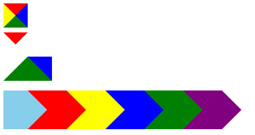

###### 6.CSS列表


###### 7.CSS背景


###### 8.CSS轮廓


###### 9.CSS边距和填充

| 属性             | 功能                |
| -------------- | ----------------- |
| margin         | 外边距,如：margin 10px |
| margin-left    | 左边距               |
| margin-top     | 上边距               |
| margin-right   | 右边距               |
| margin-bottom  | 下边距               |
| padding        | 内边距，可同时设置四个方向     |
| padding-top    | 内上边距              |
| padding-right  | 内右边距              |
| padding-bottom | 内下边距              |
| padding-left   | 内左边距              |

###### 10.CSS布局

 **1.display显示属性**

其值有：

- block：元素显示为块级元素

- inline：元素显示为行内元素

- inline-block：具备inline和block两种显示特点，多个块元素同行显示

- none：隐藏元素，元素不占位

> 扩展：若要是隐藏的元素占位，则可使用`visibility:hidden`，若要显示：`visibility:visible`。

**2.块元素**和**行内元素**


**块元素** 总是独占一行 display默认为block


<mark>特点</mark>：给块元素设置`宽高`、`边框线`、`内填充`、`外边距样式`，均有效。

**内联元素**，即行内元素，不从新行开始，只占用必要的宽度，display默认为inline


<mark>特点</mark>：

- 行内元素不能设置`宽高`样式

- 行内元素可以设置`边框线`样式

- 行内元素可以设置`内填充`样式

- 行内元素可以设置`左右方向的外边距`样式

<mark>块元素和行内元素嵌套规则</mark>

1）块元素可以包含行内元素或某些块元素；

2）行内元素只能包含其它的行内元素，不能包含块元素；

3）块元素不能放在p元素内；

4）部分特殊块元素只能包含行内元素，如：h1 ~ h6、p、dt；

5）块级元素一般与块级元素并列、行内元素与行内元素并列；

**3.overflow 溢出处理**

属性值：

- visible：默认值，溢出的内容没有被裁掉；

- hidden：溢出的内容被裁切，不支持滚动显示；

- scroll：溢出的内容被裁掉，通过滚动显示；

- auto：类似与scroll，仅在必要时才添加滚动条；

**overflow-x**和**overflow-y**

如果仅需要单个方向滚动可设置：

- `overflow-x`，水平方向滚动

- `overflow-y`，垂直方向滚动

**text-overflow**

文本溢出样式，

`text-overflow: clip|ellipsis|string|initial|inherit`;

各值含义如下：

- clip ，超出文本被裁剪；

- ellipsis ,当对象内文本溢出时显示省略号…代表被修剪的文本；

- string，使用给定的字符串来代表被修剪的文本

- initial，设置为属性默认值；

- inherit，从父元素继承该属性值

注意，需要配合以下两个属性使用：

- `white-space: nowrap`，单行显示，不换行；

- `overflow: hidden`，

**4.float 浮动**

float，其值有：

- left ，靠左

- right，靠右

该属性会使元素脱离文档流。

**5.position 定位**

`position`，其值有：

- static，默认值，静态定位

- relative，相对定位

- absolute，绝对定位

- fixed，固定定位

- sticky，粘性定位，比如：上下滑动其中一部分内容固定

说明：

1.`relative`特点：

- 相对定位需要配合left、top、right、bottom这些属性才生效；

- 相对的是`容器自身的屏幕坐标0,0点`

- 容器位置发生位移后，原来占据的空间依然有效；

- 默认会覆盖没有定位的容器

2.`absolute`特点：

- 修饰的元素会脱离文档流

- 参照点为：有定位设置的离他最近的祖先元素的0,0点坐标

- 默认会覆盖没有定位的容器

3.`fixed`特点：

- 固定定位的元素是相对于浏览器视口定位的，这意味着即使页面发生滚动，它也始终保持在同一个位置；

- top、right、bottom、left属性被用来定位元素，但不是必须得。

4.`sticky`特点

- 粘性定位初始状态相当于static定位；

- 相对于父容器的定位条件符合时，容器变现为固定定位；

- top、right、bottom或left至少声明一个，粘性定位才能生效；

一般粘性定位未生效原因：

1.父元素不能添加`overflow:hidden`或者`overflow:auto`属性；

2.元素自身必须声明top、bottom、left、right一个或多个属性，否则就相当于静态定位了；

3.父元素的高度不能低于sticky定位元素的高度；

4.sticky定位元素仅在其父元素内生效；

```html
<div class="header">
    <div class="title">首页</div>
    <div class="title">新闻</div>
    <div class="subject" >
        <div class="title">学科</div>
        <div class="droplist">
            <a href="#">语文</a>
            <a href="#">数学</a>
            <a href="#">英语</a>
            <a href="#">物理</a>
        </div>
    </div>
</div>
```

```css
.header{
    background-color: black;
    height: 50px;
    padding: 0 10px;
    position: sticky;
    top: 0;
}
.header > div{
    display: inline-block;
    color: white;
    min-width: 50px;
    line-height: 50px;
    text-align: center;
    text-decoration-line: none;
    position: relative;
    cursor: pointer;
    padding: 0px 10px;
}
.header .subject{
    padding: 0 !important;
}
.header .subject .title{
    padding: 0 10px;
    min-width: 50px;
}

.title:hover{
    background-color: skyblue;
}

.subject .droplist{
    display: none;
    width: 80px;
    background: gainsboro;
    padding: 10px 0px;
    position: absolute;
    top: 50px;
    left: 0;
}
.subject .droplist a{
    color: black;
    display: block;
    text-align: center;
    height: 30px;
    text-decoration-line: none;
    line-height: 30px;
}
.subject .droplist a:hover{
    background-color: gray;
    color: white;
}

.subject:hover .droplist{
    display: block;
}
```

运行效果：


`z-index`，z轴方向值，主要用于设置元素的前后层级

> 注意：`z-index`作用范围只在同一层级内生效，不同层级内元素的`z-index`互不影响。

示例：

```html
<div>
    <div>
        <div style="z-index:100"></div>
    </div>
    <div>
        <div style="z-index:10"></div>
    </div>
</div>
```

上述设置了`z-index`的两个元素互不影响。

###### 11.CSS表格

| 属性              | 功能          |
| --------------- | ----------- |
| border-collapse | 表格的两边框合并为一条 |

其值有：

- collapse，边框会合并为一个单一的边框。会忽略 border-spacing 和 empty-cells 属性

- separate，默认值。边框会被分开。不会忽略 border-spacing 和 empty-cells 属性

- inherit，规定应该从父元素继承 border-collapse 属性的值
